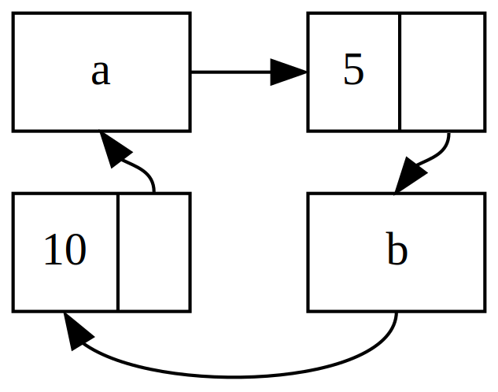

## Reference Cycles Memory Leak Kar Sakte Hain

Rust ki memory safety guarantees, galti se aisi memory banana jo kabhi clean up na ho (jise *memory leak* kehte hain), mushkil bana deti hain, lekin asambhav nahi. Memory leaks ko poori tarah se rokna Rust ki guarantees mein se ek nahi hai, jaise ki compile time par data races ko na hone dena hai. Iska matlab hai ki Rust mein memory leaks **memory safe** maane jaate hain. Hum dekh sakte hain ki Rust `Rc<T>` aur `RefCell<T>` ka upyog karke memory leaks ki anumati deta hai: aise references banana sambhav hai jahan items ek cycle mein ek doosre ko refer karte hain. Isse memory leaks hote hain kyunki cycle mein har item ka reference count kabhi bhi 0 tak nahi pahunchega, aur values kabhi bhi drop nahi hongi.

### Ek Reference Cycle Banana

Aaiye dekhen ki ek reference cycle kaise ho sakta hai aur use kaise roka jaaye, shuruaat `List` enum ki definition aur Listing 15-25 mein ek `tail` method se karte hain:

\<span class="filename"\>Filename: src/main.rs\</span\>

```rust
# fn main() {}
use std::rc::Rc;
use std::cell::RefCell;
use List::{Cons, Nil};

#[derive(Debug)]
enum List {
    Cons(i32, RefCell<Rc<List>>),
    Nil,
}

impl List {
    fn tail(&self) -> Option<&RefCell<Rc<List>>> {
        match *self {
            Cons(_, ref item) => Some(item),
            Nil => None,
        }
    }
}
```

\<span class="caption"\>Listing 15-25: Ek cons list ki definition jo `RefCell<T>` rakhti hai taaki hum badal sakein ki ek `Cons` variant kis cheez ko refer kar raha hai\</span\>

Yahan `List` ki definition ka ek aur variation hai. `Cons` variant mein doosra element ab `RefCell<Rc<List>>` hai, jiska matlab hai ki `i32` value ko modify karne ki kshamata ke bajaye (jaisa humne Listing 15-24 mein kiya tha), hum yeh modify karna chahte hain ki ek `Cons` variant kis `List` value ko point kar raha hai. Hum ek `tail` method bhi jod rahe hain taaki agar hamare paas `Cons` variant ho to hum doosre item tak aasani se pahunch sakein.

Listing 15-26 mein, hum ek `main` function jod rahe hain. Yeh code `a` mein ek list aur `b` mein ek list banata hai jo `a` ki list ko point karti hai. Phir yeh `a` ki list ko modify karke `b` ko point karvata hai, jisse ek reference cycle ban jaata hai. Is process mein alag-alag jagah par reference counts kya hain, yeh dikhane ke liye `println!` statements hain.

\<span class="filename"\>Filename: src/main.rs\</span\>

```rust
# use List::{Cons, Nil};
# use std::rc::Rc;
# use std::cell::RefCell;
# #[derive(Debug)]
# enum List {
#     Cons(i32, RefCell<Rc<List>>),
#     Nil,
# }
#
# impl List {
#     fn tail(&self) -> Option<&RefCell<Rc<List>>> {
#         match *self {
#             Cons(_, ref item) => Some(item),
#             Nil => None,
#         }
#     }
# }
#
fn main() {
    let a = Rc::new(Cons(5, RefCell::new(Rc::new(Nil))));

    println!("a initial rc count = {}", Rc::strong_count(&a));
    println!("a next item = {:?}", a.tail());

    let b = Rc::new(Cons(10, RefCell::new(Rc::clone(&a))));

    println!("a rc count after b creation = {}", Rc::strong_count(&a));
    println!("b initial rc count = {}", Rc::strong_count(&b));
    println!("b next item = {:?}", b.tail());

    if let Some(link) = a.tail() {
        *link.borrow_mut() = Rc::clone(&b);
    }

    println!("b rc count after changing a = {}", Rc::strong_count(&b));
    println!("a rc count after changing a = {}", Rc::strong_count(&a));

    // Uncomment the next line to see that we have a cycle;
    // it will overflow the stack
    // println!("a next item = {:?}", a.tail());
}
```

\<span class="caption"\>Listing 15-26: Do `List` values ka ek reference cycle banana jo ek doosre ko point kar rahe hain\</span\>

Hum variable `a` mein `5, Nil` ki shuruaati list ke saath ek `Rc<List>` instance banate hain. Phir hum variable `b` mein ek aur `Rc<List>` instance banate hain jismein value 10 hai aur woh `a` ki list ko point karta hai.

Hum `a` ko modify karte hain taaki woh `Nil` ke bajaye `b` ko point kare, jisse ek cycle ban jaata hai. Hum `tail` method ka istemal karke `a` mein `RefCell<Rc<List>>` ka reference lete hain. Phir hum us `RefCell` par `borrow_mut` method ka istemal karke andar ki value ko `Nil` wali `Rc<List>` se `b` wali `Rc<List>` mein badal dete hain.

Jab hum is code ko run karte hain, (aakhri `println!` ko comment rakhte hue), humein yeh output milega:

```text
a initial rc count = 1
a next item = Some(RefCell { value: Nil })
a rc count after b creation = 2
b initial rc count = 1
b next item = Some(RefCell { value: Cons(5, RefCell { value: Nil }) })
b rc count after changing a = 2
a rc count after changing a = 2
```

`a` ki list ko `b` ko point karne ke liye badalne ke baad `a` aur `b` dono mein `Rc<List>` instances ka reference count 2 ho jaata hai. `main` ke ant mein, Rust pehle `b` ko drop karne ki koshish karega, jisse `a` aur `b` dono ke `Rc<List>` instances ka count 1 se kam ho jayega.

Lekin, kyunki `a` abhi bhi `b` mein maujood `Rc<List>` ko reference kar raha hai, us `Rc<List>` ka count 1 hoga na ki 0, isliye `Rc<List>` dwara heap par li gayi memory drop nahi hogi. Woh memory hamesha ke liye 1 ke count ke saath wahi padi rahegi. Is reference cycle ko visualise karne ke liye, humne Figure 15-4 mein ek diagram banaya hai.



\<span class="caption"\>Figure 15-4: Lists `a` aur `b` ka ek reference cycle jo ek doosre ko point kar rahe hain\</span\>

Agar aap aakhri `println!` ko uncomment karke program run karte hain, to Rust is cycle ko print karne ki koshish karega jisme `a` `b` ko point karta hai, jo `a` ko point karta hai, aur yeh tab tak chalta rahega jab tak ki stack overflow na ho jaaye.

Is maamle mein, reference cycle banane ke theek baad program khatm ho jaata hai. Is cycle ke parinaam bahut gambhir nahi hain. Lekin, agar ek zyada complex program ek cycle mein bahut saari memory allocate karta hai aur use lambe samay tak rakhta hai, to program zaroorat se zyada memory ka istemal karega aur system ko overload kar sakta hai, jisse available memory khatm ho sakti hai.

Reference cycles banana aasan nahi hai, lekin yeh asambhav bhi nahi hai. Agar aapke paas `RefCell<T>` values hain jismein `Rc<T>` values hain, to aapko yeh sunishchit karna hoga ki aap cycles na banayein; aap Rust par unhein pakadne ke liye bharosa nahi kar sakte. Ek reference cycle banana aapke program mein ek logic bug hoga jise aapko automated tests, code reviews, aur anya software development practices ka istemal karke kam karna chahiye.

-----

## Reference Cycles ko Rokna: `Rc<T>` ko `Weak<T>` mein Badalna

Ab tak, humne dikhaya hai ki `Rc::clone` call karne se `Rc<T>` instance ka `strong_count` badh jaata hai, aur ek `Rc<T>` instance tabhi clean up hota hai jab uska `strong_count` 0 hota hai. Aap `Rc::downgrade` call karke aur `Rc<T>` ka reference pass karke `Rc<T>` instance ke andar ki value ka ek **weak reference** bhi bana sakte hain. Jab aap `Rc::downgrade` call karte hain, to aapko `Weak<T>` type ka ek smart pointer milta hai. `Rc<T>` instance mein `strong_count` ko 1 se badhane ke bajaye, `Rc::downgrade` call karna `weak_count` ko 1 se badha deta hai. `Rc<T>` type `weak_count` ka istemal yeh track karne ke liye karta hai ki kitne `Weak<T>` references maujood hain. Antar yeh hai ki `Rc<T>` instance ko clean up karne ke liye `weak_count` ka 0 hona zaroori nahi hai.

**Strong references** se aap `Rc<T>` instance ka ownership share kar sakte hain. **Weak references** ownership relationship nahi darshaate. Woh reference cycle ka kaaran nahi banenge kyunki weak references wala koi bhi cycle tab toot jaayega jab usmein shaamil values ka strong reference count 0 ho jaayega.

Kyunki `Weak<T>` jis value ko reference karta hai woh drop ho chuki ho sakti hai, `Weak<T>` dwara point ki gayi value ke saath kuch bhi karne ke liye, aapko yeh sunishchit karna hoga ki value abhi bhi maujood hai. Yeh `Weak<T>` instance par `upgrade` method call karke kiya jaata hai, jo ek `Option<Rc<T>>` return karega. Aapko `Some` ka result milega agar `Rc<T>` value abhi tak drop nahi hui hai aur `None` ka result milega agar `Rc<T>` value drop ho chuki hai.

Ek udaharan ke taur par, hum ek tree banayenge jiske items apne children items *aur* apne parent items ke baare mein jaante hain.

### Ek Tree Data Structure Banana: Child Nodes ke Saath ek `Node`

Pehle, hum ek `Node` struct banayenge jo apni `i32` value aur apne children `Node` values ke references rakhega:

\<span class="filename"\>Filename: src/main.rs\</span\>

```rust
use std::rc::Rc;
use std::cell::RefCell;

#[derive(Debug)]
struct Node {
    value: i32,
    children: RefCell<Vec<Rc<Node>>>,
}
```

Hum chahte hain ki ek `Node` apne children ka owner ho, aur hum us ownership ko variables ke saath share karna chahte hain. Iske liye, hum `children` ke `Vec<T>` items ko `Rc<Node>` type ka banate hain. Hum children ko modify bhi karna chahte hain, isliye `children` mein `RefCell<T>` hai.

Ab, hum `leaf` naam ka ek `Node` instance banayenge jiski value 3 hai aur koi children nahi hain, aur `branch` naam ka ek aur instance jiski value 5 hai aur `leaf` uske children mein se ek hai:

\<span class="filename"\>Filename: src/main.rs\</span\>

```rust
# use std::rc::Rc;
# use std::cell::RefCell;
#
# #[derive(Debug)]
# struct Node {
#     value: i32,
#     children: RefCell<Vec<Rc<Node>>>,
# }
#
fn main() {
    let leaf = Rc::new(Node {
        value: 3,
        children: RefCell::new(vec![]),
    });

    let branch = Rc::new(Node {
        value: 5,
        children: RefCell::new(vec![Rc::clone(&leaf)]),
    });
}
```

\<span class="caption"\>Listing 15-27: Ek `leaf` node banana jiska koi child nahi hai aur ek `branch` node banana jiska `leaf` ek child hai\</span\>

Hum `leaf` mein `Rc<Node>` ko clone karte hain aur use `branch` mein store karte hain, jiska matlab hai ki `leaf` mein `Node` ke ab do owners hain: `leaf` aur `branch`. Hum `branch` se `leaf` tak `branch.children` ke through ja sakte hain, lekin `leaf` se `branch` tak jaane ka koi tareeka nahi hai. Hum chahte hain ki `leaf` yeh jaane ki `branch` uska parent hai.

### Ek Child se Uske Parent ka Reference Jodna

Child node ko uske parent ke baare mein batane ke liye, humein `Node` struct mein ek `parent` field jodna hoga. Mushkil yeh hai ki `parent` ka type kya hona chahiye. Hum jaante hain ki ismein `Rc<T>` nahi ho sakta, kyunki isse ek reference cycle banega, jisse unke `strong_count` values kabhi 0 nahi honge.

Is rishte ko doosre tareeke se sochte hain: ek parent node ko apne children ka owner hona chahiye. Agar ek parent node drop hota hai, to uske child nodes bhi drop ho jaane chahiye. Lekin, ek child ko apne parent ka owner nahi hona chahiye. Agar hum ek child node ko drop karte hain, to parent abhi bhi maujood rehna chahiye. **Yeh weak references ke liye ek case hai\!**

Isliye `Rc<T>` ke bajaye, hum `parent` ka type `Weak<T>` banayenge, khaas taur par `RefCell<Weak<Node>>`. Ab hamara `Node` struct aisa dikhta hai:

\<span class="filename"\>Filename: src/main.rs\</span\>

```rust
use std::rc::{Rc, Weak};
use std::cell::RefCell;

#[derive(Debug)]
struct Node {
    value: i32,
    parent: RefCell<Weak<Node>>,
    children: RefCell<Vec<Rc<Node>>>,
}
```

Ek node apne parent node ko refer kar payega lekin uska owner nahi hoga. Listing 15-28 mein, hum `main` ko update karte hain taaki `leaf` node apne parent, `branch` ko refer kar sake:

\<span class="filename"\>Filename: src/main.rs\</span\>

```rust
# use std::rc::{Rc, Weak};
# use std::cell::RefCell;
#
# #[derive(Debug)]
# struct Node {
#     value: i32,
#     parent: RefCell<Weak<Node>>,
#     children: RefCell<Vec<Rc<Node>>>,
# }
#
fn main() {
    let leaf = Rc::new(Node {
        value: 3,
        parent: RefCell::new(Weak::new()),
        children: RefCell::new(vec![]),
    });

    println!("leaf parent = {:?}", leaf.parent.borrow().upgrade());

    let branch = Rc::new(Node {
        value: 5,
        parent: RefCell::new(Weak::new()),
        children: RefCell::new(vec![Rc::clone(&leaf)]),
    });

    *leaf.parent.borrow_mut() = Rc::downgrade(&branch);

    println!("leaf parent = {:?}", leaf.parent.borrow().upgrade());
}
```

\<span class="caption"\>Listing 15-28: Ek `leaf` node jiska apne parent node `branch` ke liye ek weak reference hai\</span\>

`leaf` node banate samay, `parent` field mein ek naya, khali `Weak<Node>` reference hota hai. Is point par, jab hum `upgrade` method ka istemal karke `leaf` ke parent ka reference lene ki koshish karte hain, to humein `None` milta hai.

```text
leaf parent = None
```

Jab `branch` node ban jaata hai, hum `leaf` ko modify karke use uske parent ka `Weak<Node>` reference de sakte hain. Hum `leaf` ke `parent` field par `borrow_mut` method ka istemal karte hain, aur phir `branch` ke `Rc<Node>` se `branch` ka `Weak<Node>` reference banane ke liye `Rc::downgrade` function ka istemal karte hain.

Jab hum `leaf` ke parent ko dobara print karte hain, to is baar humein `Some` variant milega jisme `branch` hoga: ab `leaf` apne parent ko access kar sakta hai\! Jab hum `leaf` ko print karte hain, to hum us cycle se bhi bachte hain jo stack overflow mein khatm hua tha; `Weak<Node>` references `(Weak)` ke roop mein print hote hain:

```text
leaf parent = Some(Node { value: 5, parent: RefCell { value: (Weak) }, children: RefCell { value: [Node { value: 3, parent: RefCell { value: (Weak) }, children: RefCell { value: [] } }] } })
```

Infinite output na aana yeh batata hai ki is code ne reference cycle nahi banaya.

### `strong_count` aur `weak_count` mein Badlav ko Visualise Karna

Aaiye dekhen ki `Rc<Node>` instances ke `strong_count` aur `weak_count` values kaise badalte hain, ek naya inner scope banakar aur `branch` ke creation ko us scope mein move karke. Aisa karne se, hum dekh sakte hain ki jab `branch` banaya jaata hai aur phir scope se bahar jaane par drop hota hai to kya hota hai.

\<span class="filename"\>Filename: src/main.rs\</span\>

```rust
# use std::rc::{Rc, Weak};
# use std::cell::RefCell;
#
# #[derive(Debug)]
# struct Node {
#     value: i32,
#     parent: RefCell<Weak<Node>>,
#     children: RefCell<Vec<Rc<Node>>>,
# }
#
fn main() {
    let leaf = Rc::new(Node {
        value: 3,
        parent: RefCell::new(Weak::new()),
        children: RefCell::new(vec![]),
    });

    println!(
        "leaf strong = {}, weak = {}",
        Rc::strong_count(&leaf),
        Rc::weak_count(&leaf),
    );

    {
        let branch = Rc::new(Node {
            value: 5,
            parent: RefCell::new(Weak::new()),
            children: RefCell::new(vec![Rc::clone(&leaf)]),
        });

        *leaf.parent.borrow_mut() = Rc::downgrade(&branch);

        println!(
            "branch strong = {}, weak = {}",
            Rc::strong_count(&branch),
            Rc::weak_count(&branch),
        );

        println!(
            "leaf strong = {}, weak = {}",
            Rc::strong_count(&leaf),
            Rc::weak_count(&leaf),
        );
    }

    println!("leaf parent = {:?}", leaf.parent.borrow().upgrade());
    println!(
        "leaf strong = {}, weak = {}",
        Rc::strong_count(&leaf),
        Rc::weak_count(&leaf),
    );
}
```

\<span class="caption"\>Listing 15-29: `branch` ko ek inner scope mein banana aur strong aur weak reference counts ki jaanch karna\</span\>

Jab `leaf` banaya jaata hai, uske `Rc<Node>` ka strong count 1 aur weak count 0 hota hai. Inner scope mein, hum `branch` banate hain aur use `leaf` ke saath associate karte hain. Is point par:

  * `branch` ka strong count 1 aur weak count 1 hoga (kyunki `leaf.parent` use weakly point kar raha hai).
  * `leaf` ka strong count 2 hoga (kyunki `branch.children` ne use clone kiya hai) aur weak count 0 hoga.

Jab inner scope khatm hota hai, `branch` scope se bahar chala jaata hai aur `Rc<Node>` ka strong count 0 ho jaata hai, isliye uska `Node` drop ho jaata hai. `leaf.parent` se 1 ka weak count is baat par koi asar nahi daalta ki `Node` drop hoga ya nahi, isliye humein koi memory leak nahi milta\!

Scope ke khatm hone ke baad agar hum `leaf` ke parent ko access karne ki koshish karte hain, to humein phir se `None` milega. Program ke ant mein, `leaf` mein `Rc<Node>` ka strong count 1 aur weak count 0 hota hai.

Counts aur value dropping ko manage karne ka saara logic `Rc<T>` aur `Weak<T>` aur unke `Drop` trait ke implementations mein bana hua hai. Child se parent ke rishte ko `Weak<T>` reference ke roop mein specify karke, aap parent nodes ko child nodes ko point karva sakte hain aur iske vipreet bhi, bina reference cycle aur memory leaks banaye.
